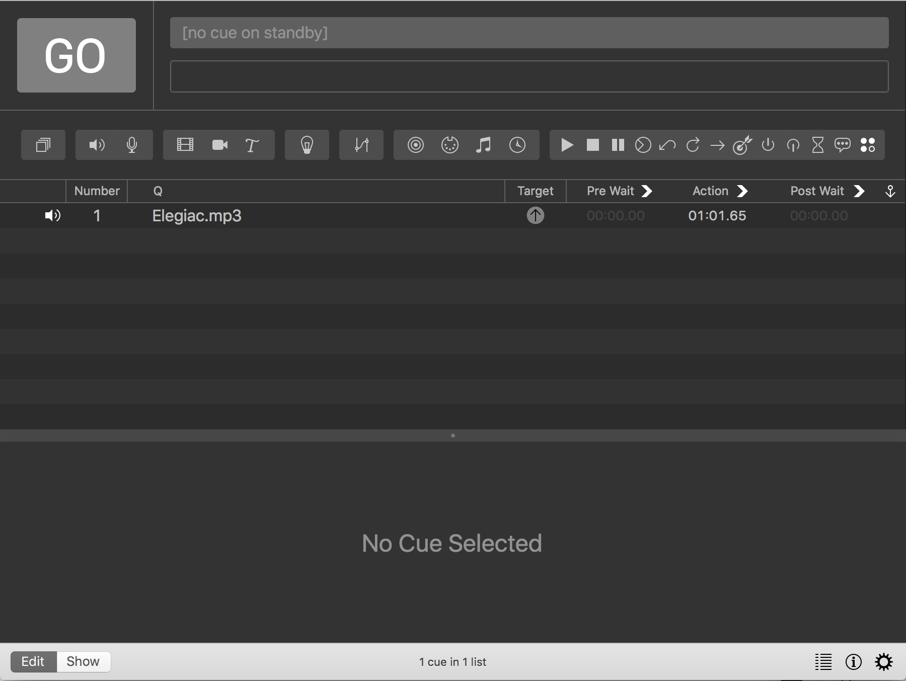
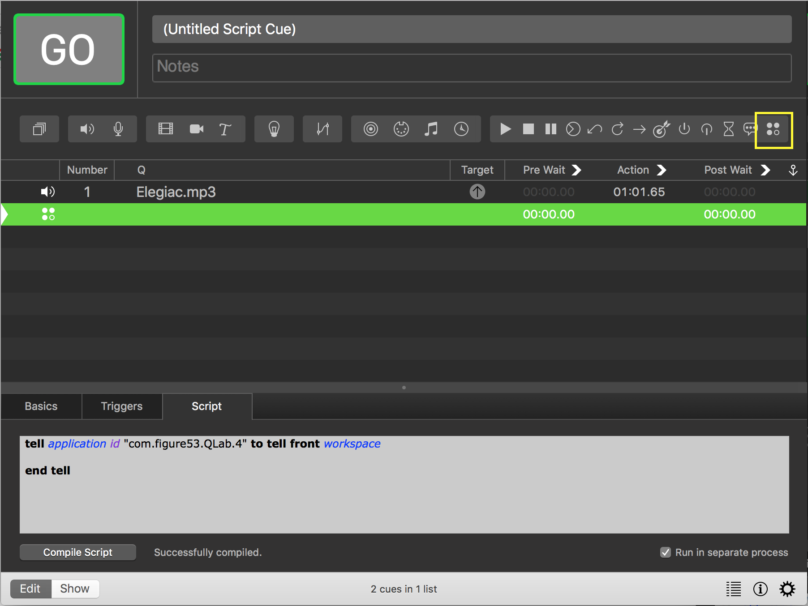
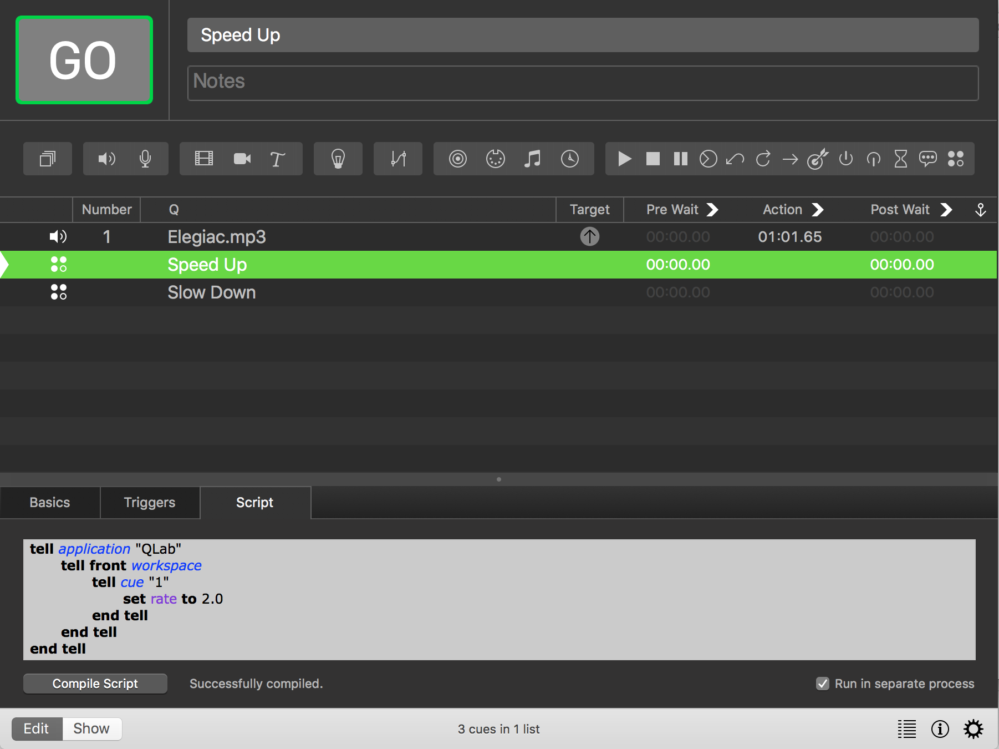
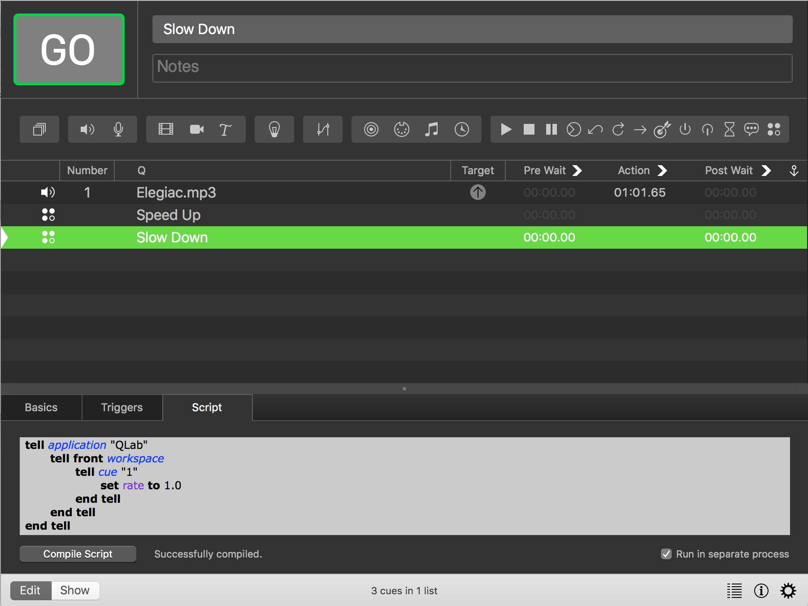

#Speed Control

There are two versions of this script.
One which will do multiple cues by iterating through a cue list and one which does a specific Cue.

###Example
- Create a new track (audio or video).

- Number it (Shortkey is N)
- Add in two Applescript Cues.

- Change the Scripts names by selecting the cues and pressing q (make a habit of defining the speed change in the cue name or in the info tab :) ).
- Paste the contents of the single script into the script tab. Make sure you change the cue number in the script. Change the rate speed accordingly.

- Make sure to reset the speed.
